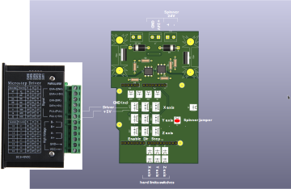

# Rolland PNC-2300

New electronics for Rolland PNC-2300.

## Conections

- Enable (inverted):

    - ENA- : GND
    - ENA+ : Arduino GPIO  (driver in Figure)

- Direction:

    - DIR- : Arduino GPIO (driver in Figure)
    - DIR+ : +5V

- Pulses:

    - PUL- : Arduino GPIO (driver in Figure)
    - PUL+ : +5V

## Software

- Arduino Uno: [grbl](https://github.com/grbl/grbl)

- PC:
  - [Universal Gcode Sender](http://winder.github.io/ugs_website/download/) (use Feed rate = 200)
  - Check:
    - https://opensource.com/article/19/1/cnc-milling-open-source-software
    - http://jscut.org/

## Refs:

- Hardware: https://blog.protoneer.co.nz/wp-content/uploads/2013/07/Arduino-CNC-Shield-Schematics.png
