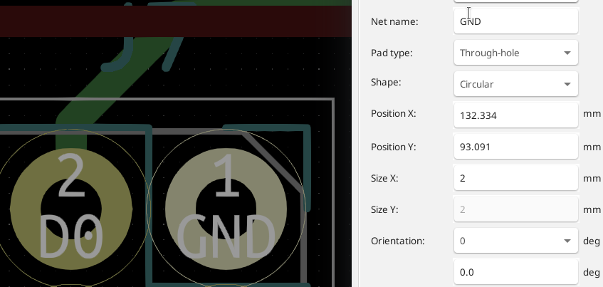
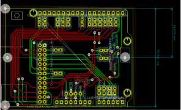
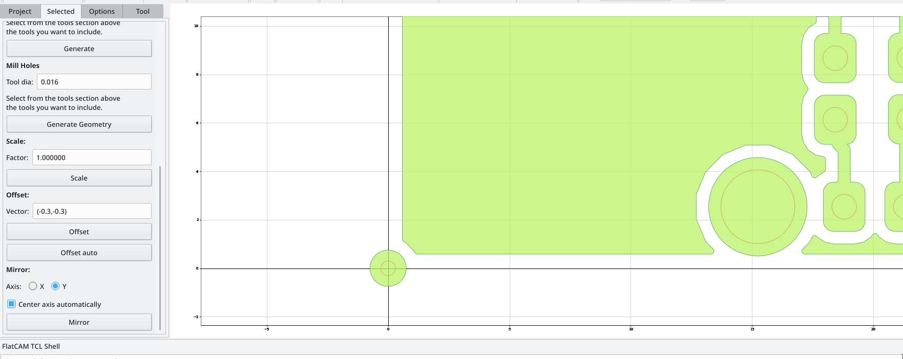
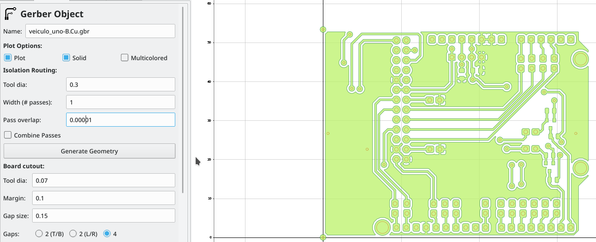
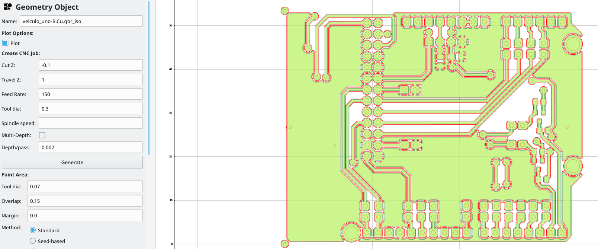
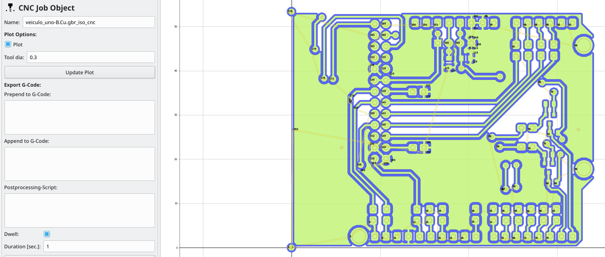
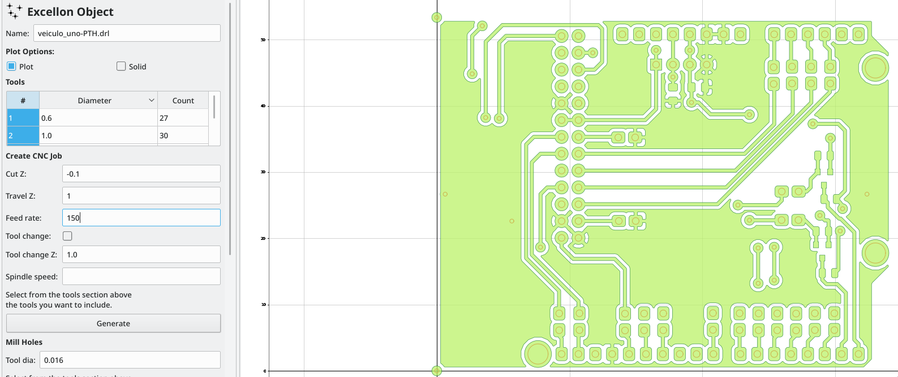
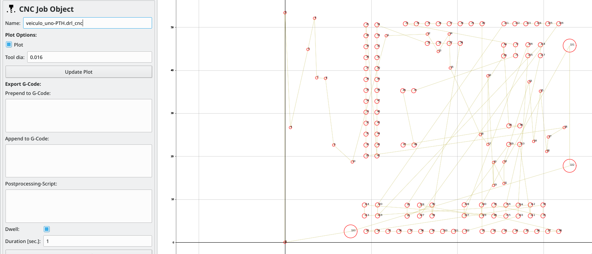

# Rolland PNC-2300

Adaptação eletrônica da Rolland PNC-2300.

Novas funções:
  - Fim de curso nos eixos x,y e z.
  - Auto nivelamento.

## Conexões:


- Enable (inverted):

    - ENA- : GND
    - ENA+ : Arduino GPIO  (driver in Figure)

- Direction:

    - DIR- : Arduino GPIO (driver in Figure)
    - DIR+ : +5V

- Pulses:

    - PUL- : Arduino GPIO (driver in Figure)
    - PUL+ : +5V

 - Switches: Habilitado debounce por software em config.h (GRBL).
             Colocado capacitor 22nF no eixo Z

 - Fundo de escala eixo Z: 26.65mm (depende da ferramenta)

 - Auto nivelamento:
    - Probe Pin (Arduino A5): https://github.com/grbl/grbl/wiki/Connecting-Grbl

## Software CNC

- Arduino Uno: [grbl](https://github.com/grbl/grbl)

```
$0 = 10    (step pulse, usec)
$1 = 25    (step idle delay, msec)
$2 = 0    (step port invert mask:00000000)
$3 = 1    (dir port invert mask:00000001)
$4 = 0    (step enable invert, bool)
$5 = 0    (limit pins invert, bool)
$6 = 0    (probe pin invert, bool)
$10 = 31    (status report mask:00011111)
$11 = 0.010    (junction deviation, mm)
$12 = 0.002    (arc tolerance, mm)
$13 = 0    (report inches, bool)
$20 = 0    (soft limits, bool)
$21 = 1    (hard limits, bool)
$22 = 1    (homing cycle, bool)
$23 = 3    (homing dir invert mask:00000011)
$24 = 200.000    (homing feed, mm/min)
$25 = 500.000    (homing seek, mm/min)
$26 = 250    (homing debounce, msec)
$27 = 1.000    (homing pull-off, mm)
$100 = 290.000    (x, step/mm)
$101 = 290.000    (y, step/mm)
$102 = 3209.000    (z, step/mm)
$110 = 500.000    (x max rate, mm/min)
$111 = 500.000    (y max rate, mm/min)
$112 = 500.000    (z max rate, mm/min)
$120 = 10.000    (x accel, mm/sec^2)
$121 = 10.000    (y accel, mm/sec^2)
$122 = 10.000    (z accel, mm/sec^2)
$130 = 200.000    (x max travel, mm)
$131 = 200.000    (y max travel, mm)
$132 = 200.000    (z max travel, mm)
```

## Software G-code

- bCNC:
  - Envio de G-codes.
  - Auto-nivelamento.
  - [bCNC Github](https://github.com/vlachoudis/bCNC)
  - [Vídeo](https://www.youtube.com/watch?v=icJ4m5zBqoA)

- Criação do G-code à partir do gerber.
  - [Flatcam](http://flatcam.org/)
  - [Vídeo](https://www.youtube.com/watch?v=O3GZsEHeH8w)

- Testes rápidos:
  - [Universal Gcode Sender](http://winder.github.io/ugs_website/download/) (use Feed rate = 200)

## Regras PCBs

| Parâmetro  |             |
|------------|-------------|
| Clearance  | 12mils      |
| Track W    | 20 a 30mils |
| Via Dia    | 1.8mm       |
| Via Drill  | 0.6mm       |
| uVia Drill | 1.8mm       |
| uVia Drill | 0.6mm       |

- Cuidado com conectores. Sugere-se aumentar a área dos pads com furo de 1mm para 2x2mm para aumentar a área de cobre pós furo. __Para alterar todos: Clique direito, pads, Push pad proprieties__



- Faça os furos de alinhamento no centro do eixo X e nos limites da placa para placas dupla-face:




## Geração de g-code pelo Flatam

1. Carregar o gerber bottom:

2. Carregar p gerber drill.

3. Fazer o espelhamento (Tools - Doubled-side PCB tool)
  - __Certifique-se que o espelhamento do Flatcam esteja de acordo com o diagrama 3D.__


3. Alinhar os furos de aliamento na coordenada (0,0) após o espelhamento.
  - Para alinhar o drill, use o vetor (-0.3, -0.3)
  - Para alinhar o bottom, use o vetor (-0.75, -0.75)
  - __Valores do vetor baseaiam-se em uma uma via: furo de 0.6mm e pad de 1.5mm após o Offset Auto.__


4. Gerar o G-Code com o seguintes parâmetros (Generate Geometry):



| Parâmetro     |       |
|---------------|-------------|
| Z Cut         | -0.1        |
| Tool diameter | 0.3 (varia com a ferramenta)       |
| Overlap       | 0.0001      |
| Feed rate     | 150         |
| Travel Z      | 1           |





5. Gerar o g-code para marcação dos furos.
  - Selecione o gerber drill.

  | Parâmetro     |       |
  |---------------|-------------|
  | Z Cut         | -0.1        |
  | Feed rate     | 150         |
  | Travel Z      | 1           |





## Usando o bCNC para usinar a placa

ToDO....

## Refs:

- Hardware: https://blog.protoneer.co.nz/wp-content/uploads/2013/07/Arduino-CNC-Shield-Schematics.png
